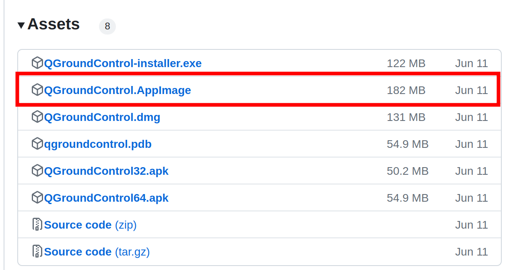

## 实机飞行

### 硬件平台

+ 无人机
  + 机载电脑：Intel NUC Kit NUC11TNKi5
  + 飞控：Pixhawk 6C
  + 动力套件：阿木实验室MFP450机架
+ 地面站
  + 地面端服务器：联想小新pro13s冰晶玉瓷限定款
+ 定位
  + Vicon
  + marker反光球


### 软件平台

+ 无人机
  + 机载电脑：Ubuntu 20.04LTS
  + 飞控：PX4 v1.14.3稳定版
+ 地面站
  + 地面端服务器：Ubuntu 20.04LTS


### 环境配置

#### 启用SSH

1. 安装`openssh-server`软件包

   > sudo apt install openssh-server

2. 验证 SSH 是否正在运行

   > sudo systemctl status ssh

3. 允许防火墙启用SSH端口（Ubuntu 自带一个配置防火墙配置工具，称为 UFW）

   > sudo ufw allow ssh

4. 局域网建立ssh连接

   > ssh username@ip_address
   >
   > 确保你将`username`修改成你自己的用户名，`ip_address`修改成你安装了 SSH 的 Ubuntu 机器的 IP 地址。

https://cloud.tencent.com/developer/article/1638882


#### 安装Mavros

> sudo apt install ros-noetic-mavros ros-noetic-mavros-extras

注意：经过多次尝试发现，还是上述二进制安装方式最保险。如果是源码编译安装的Mavros，可能会出现启动Mavros卡住不动的情况（卡在`MAVROS started. MY ID 1.240, TARGET ID 1.1`）

https://cloud.baidu.com/article/3285523

如果遇到了如下报错

> UAS: GeographicLib exception: File not readable /usr/share/GeographicLib/geoids/egm96-5.pgm | Run install_geographiclib_dataset.sh script in order to install Geoid Model dataset!

执行如下命令

> $ wget https://raw.githubusercontent.com/mavlink/mavros/master/mavros/scripts/install_geographiclib_datasets.sh
>
> $ sudo bash ./install_geographiclib_datasets.sh   


https://docs.px4.io/v1.12/en/ros/mavros_installation.html

https://junmo1215.github.io/tutorial/2019/07/14/tutorial-install-ROS-and-mavros-in-raspberry-pi.html#%E5%AE%89%E8%A3%85geographiclib-datasets


#### 安装Vrpn

+ 安装依赖

  > sudo apt-get install ros-noetic-vrpn 

+ 将源码放入catkin工作目录进行编译

  > cd ~/catkin_ws/src 
  > git clone https://gitee.com/ASSIL/vrpn_client_ros.git
  > cd ~/catkin_ws
  > catkin_make

+ 获取动捕数据

  > roslaunch vrpn_client_ros sample.launch

https://gitee.com/ASSIL/vrpn_client_ros

https://gitee.com/ASSIL/vrpn_client_ros/blob/assil/manual/vicon/vicon_manual.md


#### 安装QGC

QGC全称：qgroundcontrol

+ 下载QGC，https://github.com/mavlink/qgroundcontrol/releases

  

+ 双击运行


#### 安装PlotJuggler

> sudo apt install ros-noetic-plotjuggler 

以ros节点的方式启动PlotJuggler

> $ roscore
>
> $ rosrun plotjuggler plotjuggler


#### 安装起飞测试程序

```shell
cd ~/catkin_ws/src
git clone https://github.com/3113373723/offboard-vicon.git
cd ~/catkin_ws
catkin_make

# 本项目主要包含两个例程，分别写在两个launch文件中
# 1.机载电脑控制无人机起飞定点悬停15s后降落
source ./devel/setup.bash
roslaunch offboard takeoff.launch

# 2.机载电脑控制无人机起飞，飞一个正方形，然后降落
roslaunch mavros px4.launch
# 再开一个终端
source ./devel/setup.bash
roslaunch offboard new.launch 
```


### 起飞步骤

1. Vicon校正
2. QGC无人机校正
3. 起飞测试


#### Vicon校正

需要已经安装好`VICON TRACKER 3.8`。

1. 打开软件，再打开 Vicon 电源，等待摄像头全部变为绿色即初始化完成
2. 打开`CALIBRATE`页，在`CREATE CAMERA MASKS`中点击`START`，等待几秒中，待视图中的反光点没有变化后点击`STOP`。
3. 在`CALIBRATE CAMERAS`中点击`START`，打开魔术棒上的开关，在 Vicon 建模的空间内挥舞魔术棒，直到摄像头的灯从闪烁的红紫色变为绿色后，所有的摄像头都会呈现不闪烁的红紫色，等待`CAMARA CALIBRATION FEEDBACK`进度条到达 100%，下方所有摄像头数据格均为绿色，即代表建模成功。
4. 在`SET VOLUME ORIGIN`中点击`START`，在建模空间中取坐标原点，将魔术棒摆放至预期的坐标原点处，魔术棒的左短边指向`x`轴，长边指向`y`轴，然后点击`SET`，原点设置成功，将无人机放置到原点处，PX4 模块的箭头指向`x`轴的方向。
5. 将视图左上角的`CAMERA`切换为`3D ORTHOGONAL`，按住鼠标右键移动鼠标进行缩放，缩放到合适的大小，按住`alt`点击鼠标左键进行反光点的选取，需要选中所有的反光点，此时如果出现闪烁的反光点意味着建模出现了偏差，此时需要从第 2 步开始重新进行建模，直到可以选中所有的反光点。
6. 选中反光点后，打开`OBJECTS`页面，在下面的文本框中输入无人机的名字，例如`uav1`，点击`CREATE`，此时 Vicon 所需工作全部完成。（**注意**：名称应与roslaunch文件中保持一致）
7. 注意：如果在校正过程出现某个镜头标红而失败的情况，需要在C盘—>programdata—>vicon （隐藏文件夹）里面找到calibration文件夹，把里面的文件都删除，然后再打开软件

https://blog.csdn.net/sinat_16643223/article/details/117755833


#### QGC无人机校正

需要已经安装好`QGroundControl`软件，刷好PX4 硬件对应的固件。

如果使用的是飞控、飞控固件、动力套件与上述一致，则可以直接加载`materials\NUC.params`文件，然后再校准传感器、遥控器和飞行模式即可。

1. 首先打开遥控器，进行遥控器设置，以RadioLink AT9S Pro遥控器为例，长按mode进入设置

   + 机型选择 —> `机型: 多旋翼模型`
   + 辅助通道 —>
     + `Channel 5: ——— <— 姿态选择`
     + `Channel 6: SwA`
     + `Channel 7: SwB`
     + `Channel 8: SwE`
     + `Channel 9: SwF`
     + `Channel 10: NULL`

2. 将 PX4 模块的`micro USB`和电脑的 USB 连接起来（连接电脑之前需要断开机载计算机与 PX4 TELEM1 的连接），打开 QGC，直到左上角的状态从`DISCONNECT`变为`Not Ready`，则连接成功。

3. 点击左上角的图标，进入 `Vehicle Setup`页面。

   - 概况：浏览飞机概况

   - 固件：根据提示重新插拔 USB ，进入固件烧录页面，选择固件进行烧录，这一步在不改动 PX4 固件的情况下无需执行。

   - 机架：选择无人机对应的机身框架，这里选择通用的四旋翼机架Generic Quadcopter

     

   - 传感器：根据软件指示，以此进行罗盘、陀螺仪、加速度计、校平地平线、Orientations的校准。无人机长时间空置或者遭受碰撞等等情况下都需要重新校正。尽量在安装时将PX4硬件放置在**无人机中心部位**。

   - 遥控器：更换遥控器后需要重新校准。更换遥控器时要将遥控器开至配对模式，用取卡针长按机身接收模块的复位按钮，待接收器和遥控器配对成功。再点击校准，选择模式，按提示拨动遥控器，完成后点击下一步，直到结束。值得注意的是，右手油门模式选择模式一（日本手），左手油门模式选择模式二（美国手）。**实验室传统是用模式二美国手**。

   - 飞行模式：

     这一项根据个人遥控器习惯进行设置

     + `模式频道：Channel 5`

       + `飞行模式1：Stablized`
       + `飞行模式4：Position`
       + `飞行模式6：Altitude`

     + `Arm switch channel：Channel 9`

     + `Emergency Kill switch channel：Channel 7`

     + `Offboard switch channel：Channel 6`

       

   - 电源：

     插入电池，但不要接通电池。点击`校准`后，立刻接通电池，此时PX4硬件有欢快尖锐音乐则说明电调校准成功

     

   - Actuators：

     按如下图示数字顺序依次点击，检查电机旋转方向是否和图上一致

     

   - 安全：

     

   - 参数：通过搜索栏搜索以下参数，不一致的需要修改

     - CBRK系列参数参数设置：解除一些解锁设置(如安全开关，无GPS信号等)
       - CBRK_IO_SAFETY 设为 22027
       - CBRK_BUZZER 设为 782097
       - CBRK_USB_CHK 设为 197848
       - CBRK_SUPPLY_CHK 设为 894281
       - 以上参数的逻辑为：设为0，则无人机解锁时会检查此项；设为最大值，则不检查此项。以 CBRK_IO_SAFETY 为例，设为 0，若安全开关没有打开，则无人机无法解锁；设为22027，则跳过该检查。
     - MAVLink 系列参数设置：
       - MAV_1_CONFIG 设置 TELEM2
       - MAV_1_MODE 设置为 Onboard
       - SER_TEL4_BAUD 设置为 921600
     - EKF2 系列参数设置：如果使用外部定位设备，需要设置此项；户外 GPS 飞行，此项不设置
       - EKF2_AID_MASK 设置为 24(vision position fusion和 vision yaw fusion)
       - EKF2_HGT_MODE 设置为 Vision
     - 位置控制参数：对飞行的速度等进行限制幅度处理，出于安全考虑
       - MPC_THR_HOVER 依据实际情况设定(这个是悬停油门，可以通过手动飞行大致确定)，当在起飞测试中出现过冲现象时将这一项设置为20%~25%。示例使用的阿木实验室MFP450机架该项设置为50%。
       - MPC_TILTMAX_AIR 设置为 20deg(这一项可以限定最大倾斜角，即限定速度)
       - MPC_XY_VEL_MAX 设置为 0.7m/s(限定水平最大合速度，依据实际情况设定，建议小一点)
       - MPC_Z_VEL_MAX_DN 设置为 0.5m/s
       - MPC_Z_VEL_MAX_UP 设置为 0.5m/s
       - 其他位置控制参数依据实际情况设定
     - offboard 丢失的 failsafe 设置
       - COM_OBL_ACT 设置为 Land mode
       - COM_OBL_RC_ACT 设置为 Land mode
       - COM_OF_LOSS_T 设置为 1s
     - 设置自动加锁时间：
       - COM_DISARM_LAND设置为-1，表示不自动加锁

#### 起飞测试

1. 保证飞机平稳水平放置在原点后上电。**警告**，实验结束后先进行断电！

2. 连接机载电脑：

   1. 上位机和机载电脑要同处于 Vicon 的网络中，然后用 SSH 连接机载电脑

      ```shell
      # ip_address为机载电脑ip
      ping ip_address
      
      # ping 通后连接，密码和用户名一致
      ssh username@ip_address
      ```

   2. 机载电脑启动起飞测试代码的 launch 文件

      ```shell
      roslaunch offboard takeoff.launch
      ```

   3. 打开遥控器，连上无人机后，解锁无人机，进入 offboard 模式，此时无人机应该已经打开螺旋桨，并开始悬停在1米高的空中。从运行launch文件瞬间开始算起，大约15秒后无人机会自己降落。

   4. 注意：起飞前需要校验，如果获取不到信息有可能是vicon需要重启

      ```
      // remote PC
      rostopic echo /uav1/mavros/local_position/pose
      
      // uav
      rostopic echo /vrpn_client_node/uav1/pose
      
      //可检查rostopic list，以下三个为一组
      /vrpn_client_node/uav1/accel
      /vrpn_client_node/uav1/pose
      /vrpn_client_node/uav1/twist
      ```


## 可能会遇到的问题和解决方法

### Mavros启动后卡住

mavros可以启动成功，但是会卡在：`MAVROS started. MY ID 1.240, TARGET ID 1.1`

原因可能有很多

+ 改用二进制方式安装mavros

+ 先检查launch文件的串口及波特率是否和飞控的串口及波特率一致，检查填写是否正确
+ 是否是USB接口电压不够，导致机载电脑无法识别到飞控（见到有博客说可以通过判断电源灯亮了，提示音响了，来判断飞控是否启动，没试过）
+ 按照下面的博客依次排查问题

https://blog.csdn.net/weixin_45910027/article/details/131680387


### 起飞后漂移

检查vicon校准的坐标系和px4坐标系是否一致。无人机PX4 硬件的箭头指向`x`轴的方向。校准vicon时，魔术棒的左短边指向`x`轴，长边指向`y`轴。